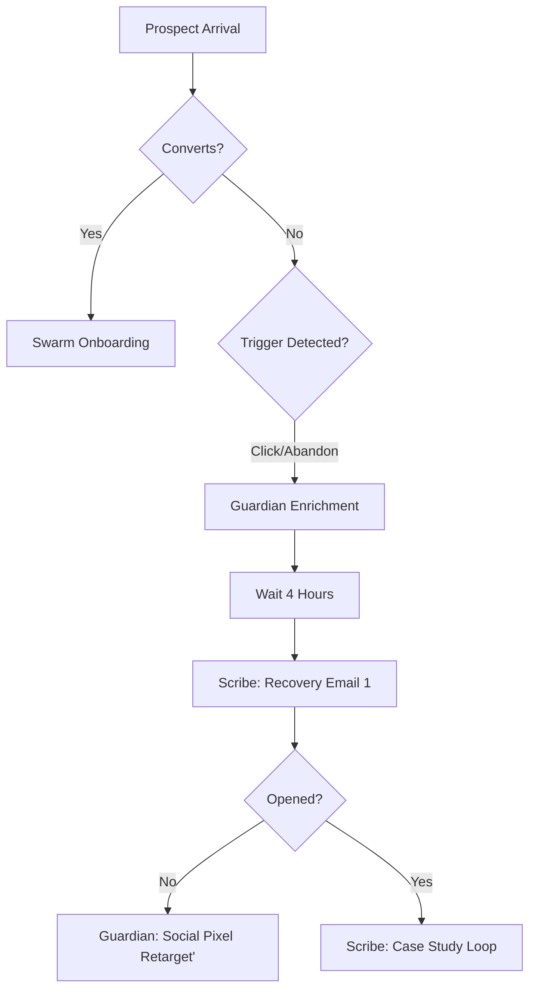

# DOUBLE TAP: LEAD RECOVERY ARCHITECTURE
**Agent:** Guardian | **Task:** Mission E (Recovery Systems)

## 1. DROP-OFF TRIGGERS
Guardian monitors the following events via the Lexi OS pixel/API integration:

| Trigger ID | Event | Condition | Guardian Action |
|------------|-------|-----------|------------------|
| **DT_01** | Click-Without-Book | User clicks CTA but exits < 60s. | Tag: `INTENT_IDENTIFIED`. Standby 4h. |
| **DT_02** | Form-Abandonment | User fills 50% of fields but exits. | Tag: `FRICTION_DETECTED`. Immediate data enrichment. |
| **DT_03** | No-Show Recovery | Consultation booked but status: `MISSED`. | Tag: `SYSTEM_UNLOCKED`. Trigger "Authority Loop." |

## 2. BEHAVIORAL HANDOFFS (to Scribe)

### Handoff Alpha (DT_01/DT_02)
- **Wait Time**: 4 hours (avoid desperation).
- **Scribe Sequence**: "The System is Waiting."
- **Messaging**: "You initiated a systems audit but didn't finish the scan. Most owners exit here because the DIY Trap is strong. We've saved your slot."

### Handoff Beta (DT_03)
- **Wait Time**: 1 hour post-missed call.
- **Scribe Sequence**: "Momentum Check."
- **Messaging**: "Missing a consultation is a symptom of the Revolving Door. You're too busy managing the noise to build the system. Let's recalibrate."

## 3. RETARGETING LOGIC MAP

## 4. VOICE COMPLIANCE (Guardian Recovery)
- **Forbidden Tone**: No "Where did you go?", no "Limited time offer!!", no "Special discount for you!".
- **Calm Authority Tone**: "We noticed a gap in your system initialization. We're holding the console open for 24 hours. Control is better than guesswork."

---
## HANDOFF: SCRIBE
Guardian triggers `RETARGETING_FLOW_V1`. Scribe: Draft the "System Waiting" recovery email based on these triggers.
